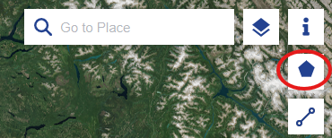
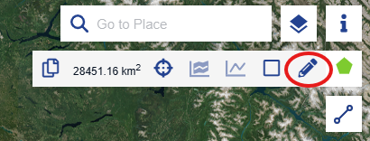
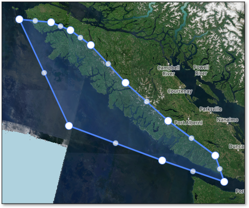
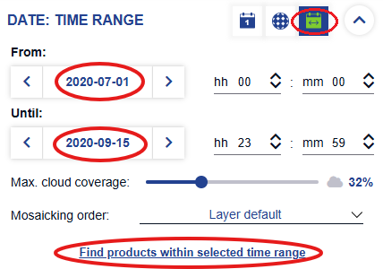
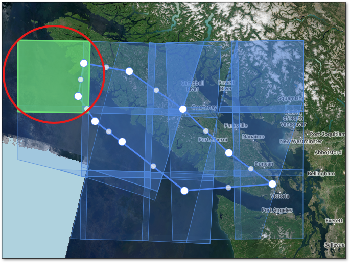
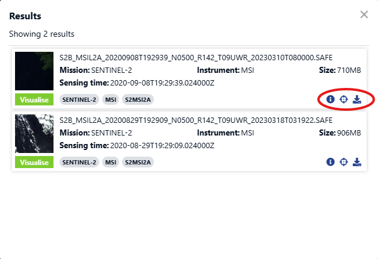

# SKeMa
[](https://doi.org/10.57967/hf/6790)
[](https://huggingface.co/m5ghanba/SKeMa)
[](https://pypi.org/project/skema-kelp/)
[](https://opensource.org/licenses/MIT)
[](https://creativecommons.org/licenses/by/4.0/)

**Satellite-based Kelp Mapping using Semantic Segmentation on Sentinel-2 imagery**

`skema` is a Python tool for classifying kelp in Sentinel-2 satellite images using a deep learning segmentation model (PyTorch). It provides a command-line interface (CLI) for easy, reproducible inference. To run the tool you would need to download Sentinel-2 images from the Copernicus Browser. More detailed instruction on how to download these images can be found in Section Usage. The following instructions are provided for anyone with no knowledge of what a command line is, no knowledge of Python or virtual environments, etc. Just follow along step by step.

**Model available on Hugging Face**: [m5ghanba/SKeMa](https://huggingface.co/m5ghanba/SKeMa)  
**DOI**: [10.57967/hf/6790](https://doi.org/10.57967/hf/6790)

---

## Table of Contents
- [Quick Start (Experienced Users)](#-quick-start-experienced-users)
- [Citation](#citation)
- [Installation](#-installation)
  - [Step 1: Install Python](#step-1-install-python)
  - [Step 2: Install SKeMa](#step-2-install-skema)
- [Usage](#️-usage)
  - [Activating the Virtual Environment](#activating-the-virtual-environment)
  - [Downloading Sentinel-2 Images](#downloading-sentinel-2-images)
  - [Running SKeMa](#running-skema)
  - [Model Types](#model-types)
  - [Output Files](#output-files)
  - [Opening and Visualizing Kelp Maps in QGIS](#opening-and-visualizing-kelp-maps-in-qgis)
- [Static Files](#️-static-files)
- [GPU Support](#️-gpu-support)
- [Project Structure](#️-project-structure)
- [License](#-license)

---

##  Quick Start (Experienced Users)
```bash
pip install skema-kelp

# Download static files (for model_full only) from sources listed below
# Download Sentinel-2 imagery from https://dataspace.copernicus.eu/browser/

skema --input-dir "path/to/S2_scene.SAFE" --output-filename output.tif

# For help and all options
skema --help
```

**For detailed installation instructions (beginner-friendly), see [Installation](#-installation) below.**

---

## Citation

If you use **SKeMa** in your research or work, please cite:

```bibtex
@software{skema_2026,
  author       = {Mohsen Ghanbari, Neil Ernst, Taylor A. Denouden, Luba Y. Reshitnyk, Piper Steffen, Alena Wachmann, Alejandra Mora-Soto, Eduardo Loos, Margot Hessing-Lewis, Nic Dedeluke, Maycira Costa}, 
  title        = {SKeMa: Satellite-based Kelp Mapping using Semantic Segmentation on Sentinel-2 imagery},
  year         = 2026,
  publisher    = {Hugging Face},
  doi          = {10.57967/hf/6790},
  url          = {https://huggingface.co/m5ghanba/SKeMa}
}
```

---

##  Installation

Before you can set up SKeMa, you'll need **Python** (version **3.9 to 3.12**) installed on your computer. Python is a free tool, and no accounts or sign-ups are required to install it. We'll install it using your terminal (command line) where possible for simplicity. If you're on Windows, ensure you're using **PowerShell** or **Command Prompt** as Administrator (right-click and select "Run as administrator") for some steps. In some cases, however, you may need to use Command Prompt instead of PowerShell because PowerShell can handle command resolution and PATH variables differently, which may prevent it from recognizing Python even if it is installed. Additionally, if Python was installed only for your user account (and not system-wide), it may only be accessible from a normal Command Prompt session rather than one opened as Administrator, since elevated terminals can use a different set of environment variables.

### Step 1: Install Python

**Checking Your Current Python Version:**

Before proceeding, check if you already have Python between versions 3.9 and 3.12 on your computer.
Open a terminal (PowerShell, Command Prompt, or macOS/Linux terminal).

Run:
```
python --version
```
or, on macOS/Linux, try:
```
python3 --version
```

If the version shown is between 3.9 and 3.12 (e.g., Python 3.9.13, Python 3.11.5, Python 3.12.7), you already meet the requirement and can skip the installation steps below. Otherwise, follow the instructions below to install Python.

#### On Windows
1. **Download the Python 3.12.7 installer** directly from the Python website:
   - [https://www.python.org/ftp/python/3.12.7/python-3.12.7-amd64.exe](https://www.python.org/ftp/python/3.12.7/python-3.12.7-amd64.exe)

2. **Run the installer**:
   - **IMPORTANT**: At the very first screen, check the box that says **"Add Python to PATH"**. This option is **unchecked by default** — if you miss it, Python will not be recognized by your terminal.
   - Click "Install Now" and follow the prompts.

3. **Verify the installation**:
   - Open **Command Prompt** (search for `cmd` in the Start menu). Use Command Prompt, not PowerShell, as PowerShell can sometimes fail to recognise Python even if it is installed.
   - Run `python --version`. It should output `Python 3.12.7`.
   - If you see an error, close and reopen Command Prompt and try again. If it still fails, search online for "add Python to PATH Windows".

#### On macOS
1. **Install Homebrew** (a package manager for CLI installations, if you don't have it):
   - Open Terminal (search for it in Spotlight with Cmd+Space).
   - Run:
     ```
     /bin/bash -c "$(curl -fsSL https://raw.githubusercontent.com/Homebrew/install/HEAD/install.sh)"
     ```
   - Follow any on-screen prompts (it may ask for your password; this is normal). No account needed.
   - After installation, run the commands it suggests to add Homebrew to your PATH (e.g., `echo 'eval "$(/opt/homebrew/bin/brew shellenv)"' >> ~/.zprofile` and then `eval "$(/opt/homebrew/bin/brew shellenv)"`).
   - Verify: Run `brew --version`. It should show a version like "4.3.0".

2. **Install Python 3.12**:
   - Run:
     ```
     brew install python@3.12
     ```
   - This installs Python and adds it to PATH.
   - Verify: Run `python3 --version` (note: use `python3` on macOS). It should output "Python 3.12.7".

   *Alternative*: Download the official installer from [python.org](https://www.python.org/downloads/macos/) using your browser, run it, and follow GUI steps. **Make sure Python is added to your PATH during installation.**

#### On Linux (e.g., Ubuntu/Debian; adjust for other distros like Fedora)
1. **Update your package list**:
   - Open your terminal.
   - Run:
     ```
     sudo apt update
     ```
   - Enter your password when prompted (sudo is for admin privileges; no account needed beyond your user login).

2. **Install Python 3.12**:
   - Run:
     ```
     sudo apt install python3.12 python3.12-venv python3-pip
     ```
   - This installs Python, the venv module, and pip.
   - Verify: Run `python3 --version`. It should output "Python 3.12.x".
   - *For Fedora/RHEL*: Use `sudo dnf install python3.12` instead.

   *Note*: If your distro's repositories don't have Python 3.12, add a PPA (e.g., for Ubuntu: `sudo add-apt-repository ppa:deadsnakes/ppa` then update and install).

Once Python is installed and verified, proceed to the next section. If you encounter errors (e.g., "command not found"), search online for the exact error message + your OS.

### Step 2: Install SKeMa

Open your **terminal**:  
- On **Windows**, you can use Command Prompt or PowerShell.  
- On **macOS**, open the Terminal app.  
- On **Linux**, open your terminal emulator of choice.  

When you open a terminal, you start inside a **directory (folder)**. You can move to another directory with the command `cd`. For example:  

```  
cd C:\Users\YourName\Documents  
```  

On macOS/Linux:  

```  
cd /Users/yourname/Documents  
```  

👉 The easiest way to navigate is to open your file explorer, go to the folder you want, then copy its full path and paste it after `cd` on the command line. For more details, look up "basic terminal navigation" online.  

Now, navigate to a directory where you want to work with SKeMa, then run:

#### Option 1: Install with pip (Recommended)

```bash
# Create a virtual environment 
python -m venv skema_env

# Activate the virtual environment
# On Windows:
skema_env\Scripts\activate
# On macOS/Linux:
source skema_env/bin/activate

# Install SKeMa
pip install skema-kelp
```
> ⚠️ **Windows only — "Access Denied" when activating the environment**
>
> This is caused by PowerShell's execution policy, which blocks scripts from running by default on many Windows systems. Fix it by running this command **once** in PowerShell:
> ```
> Set-ExecutionPolicy -Scope CurrentUser -ExecutionPolicy RemoteSigned
> ```
> Type `Y` and press Enter when prompted. This only affects your own user account and does not change system-wide security settings. After running it, try activating the environment again.

> ⏳ **Installation Time**: The installation may take up to **10 minutes** to complete. A large amount of text will scroll past — this is normal. You will know it is finished when you see a line like `Successfully installed skema-kelp-X.X.X` and your command prompt reappears.

> ⚠️ **Opencv issue for macOS users**:
> In some cases, the installation may fail while building the opencv-python-headless dependency (a computer vision library required by albumentations). If you see an error mentioning OpenCV or "Failed building wheel for opencv-python-headless", install OpenCV separately first and then install SKeMa again:

```bash
pip install opencv-python-headless==4.9.0.80
pip install skema-kelp
```

This installs a precompiled OpenCV wheel for macOS and avoids a lengthy build process.

#### Option 2: Install from source (for developers)

If you want to modify the code or contribute to development:

```bash
# Install Git first (see system-specific instructions below)
# Then clone the repository
git clone https://github.com/m5ghanba/skema.git
cd skema

# Create and activate virtual environment
python -m venv skema_env
# On Windows:
skema_env\Scripts\activate
# On macOS/Linux:
source skema_env/bin/activate

# Install in development mode
pip install -e .
```
Alternatively, users can use the provided `poetry.lock` file with Poetry (poetry install), which will automatically create and manage a virtual environment while ensuring all dependencies are installed with exact, reproducible versions.

**Installing Git (only needed for Option 2):**
- **Windows**: `winget install --id Git.Git -e --source winget` or download from [git-scm.com](https://git-scm.com/download/win)
- **macOS**: `brew install git` or download from [git-scm.com](https://git-scm.com/download/mac)
- **Linux**: `sudo apt install git` (Ubuntu/Debian) or `sudo dnf install git` (Fedora/RHEL)

Each line explained:  
- `python -m venv skema_env`: Creates a virtual environment named `skema_env` to isolate project dependencies.  
- `skema_env\Scripts\activate` (Windows) or `source skema_env/bin/activate` (macOS/Linux): Activates the virtual environment, ensuring subsequent commands use its isolated Python and packages.  
- `pip install skema-kelp`: Installs SKeMa and all its dependencies from PyPI.

If you encounter packaging errors, make sure your pip and build tools are up to date:

```bash
pip install --upgrade pip setuptools wheel
```

---

##  Usage

### Activating the Virtual Environment

To use SKeMa after the initial installation, you must activate its virtual environment each time you start a new session (if you created one). Follow these steps each time you want to run the tool:

1. **Open a terminal** (Command Prompt, PowerShell, or Terminal).
2. **Navigate to the directory** where you created the virtual environment:
   - **On Windows:**
     ```
     cd path\to\your\directory
     ```
   - **On macOS/Linux:**
     ```
     cd path/to/your/directory
     ```
3. **Activate the virtual environment:**
   - **On Windows:**
     ```
     skema_env\Scripts\activate
     ```
   - **On macOS/Linux:**
     ```
     source skema_env/bin/activate
     ```
4. **Run SKeMa** using the commands described below.

If your command line prompt shows `(skema_env)`, the virtual environment is activated and you're ready to proceed.

### Downloading Sentinel-2 Images

SKeMa uses Sentinel-2 satellite images, which can be downloaded from the [Copernicus Browser](https://dataspace.copernicus.eu/browser/). You will need a free account to access and download these images, which are provided as `.zip` files.

#### Sentinel-2 Image Download Instructions

Follow these steps to download Sentinel-2 images:

1. **Go to the Copernicus Browser**: Navigate to [https://browser.dataspace.copernicus.eu/](https://browser.dataspace.copernicus.eu/)

2. **Register**: If you haven't already, create a free account by clicking on the "Register" option.

3. **Sign in**: Log in to your account using your credentials.

4. **Create an area of interest**: Click on the top right option **"Create an area of interest"** (the pentagon shape icon).
   
   

5. **Draw your polygon**: Click on the option **"Draw polygon of interest..."** (the pencil shape icon).
   
   

6. **Define your area**: Draw a polygon around your area of interest by clicking on the map to create points. Close the polygon by clicking on the first point you placed.
   
   

7. **Set parameters and search**: 
   - Select the **Time Range** option and set the dates in the **"From"** and **"Until"** fields.
   - Optionally, set the **cloud coverage** filter.
   - Click on **"Find products within selected time range"**.
   - Verify that **Sentinel-2 L2A** is selected as the data level (default setting).
   
   

8. **Choose your Sentinel-2 scene**: From the map, select the desired Sentinel-2 scene by clicking on it.
   
   

9. **Preview and download**: 
   - Click on the **"i"** option to view a preview of the image and quick information.
   - Click on the **download icon** (located at the bottom right) to download the scene.
   
   


### Running SKeMa

SKeMa can be run on a single Sentinel-2 scene or on a directory of multiple scenes at once.

#### Single Scene

```bash  
skema --input-dir "path/to/sentinel2/scene.SAFE" --output-filename output.tif  
```

- `--input-dir` must be the full path to the `.SAFE` folder.  
  - Sentinel-2 images from the Copernicus Browser come as `.zip` files. Extract them first.  
  - Then, pass the full path to the `.SAFE` folder (e.g., `"C:\...\S2C_MSIL2A_20250715T194921_N0511_R085_T09UUU_20250716T001356.SAFE"`).
  - **Note**: If your path or output filename contains spaces, enclose it in double quotation marks (as shown in the example).

- `--output-filename` is the name of the output file (e.g., `output.tif`). You only need to provide the filename, not the full directory path. The output will be saved in a folder created alongside the `.SAFE` folder.

#### Batch Mode (Multiple Scenes + Mosaic)

If you have multiple Sentinel-2 scenes to process, use the `--batch-dir` flag instead of running the tool repeatedly. Place all your unzipped `.SAFE` folders inside a single directory and point `--input-dir` to that directory:

```bash
skema --input-dir "path/to/folder/with/safe/files/" --output-filename output.tif --batch-dir
```

SKeMa will:
1. Detect all `.SAFE` folders inside the directory automatically.
2. Process each scene individually, exactly as in single-scene mode.
3. Save each scene's prediction inside a subfolder named after that scene. The output filename will be the scene name with your `--output-filename` value appended as a suffix. For example, if the scene is `S2B_MSIL2A_20220806T191919_N0510_R099_T10UCV_20240718T204439.SAFE` and `--output-filename` is `output.tif`, the prediction will be saved as:
   ```
   path/to/folder/with/safe/files/
   └── S2B_MSIL2A_20220806T191919_N0510_R099_T10UCV_20240718T204439/
       ├── S2B_MSIL2A_20220806T191919_N0510_R099_T10UCV_20240718T204439_B2B3B4B8.tif
       ├── S2B_MSIL2A_20220806T191919_N0510_R099_T10UCV_20240718T204439_B5B6B7B8A_B11B12.tif
       ├── ...
       └── S2B_MSIL2A_20220806T191919_N0510_R099_T10UCV_20240718T204439_output.tif
   ```
4. After all scenes are processed, generate a single mosaic by merging all predictions into one GeoTIFF saved as `mosaic_kelp_map.tif` in the input directory:
   ```
   path/to/folder/with/safe/files/
   ├── S2B_MSIL2A_.../
   ├── S2B_MSIL2A_.../
   └── mosaic_kelp_map.tif   ← combined prediction for all scenes
   ```

The mosaic is reprojected to BC Albers (EPSG:3005) at 10 m resolution (this is important if skema is applied to other regions in the world). Overlapping pixels between scenes are resolved by taking the maximum value, meaning a pixel is classified as kelp if any contributing scene predicted kelp there.

### Model Types

SKeMa supports a few model types, selectable via the --model-type flag:

1. **`model_s2bandsandindices_only`** (default): Uses only Sentinel-2 bands and derived spectral indices. This model does not require bathymetry or substrate files, making it suitable for areas outside British Columbia or when these static files are unavailable. 

2. **`model_full`**: Uses Sentinel-2 bands, as well as bathymetry, and substrate information. 

3. **`model_ensemble`**: An ensemble model that combines predictions from both `model_full` and `model_s2bandsandindices_only` by averaging their outputs. This model requires the same static files as `model_full` (bathymetry and substrate) and can provide more robust predictions by leveraging both modeling approaches.

If `--model-type` is not specified, the tool defaults to `model_s2bandsandindices_only`.

> ⚠️ **Static Files**
>
> As noted above, model_full and model_ensemble require additional static files. These files must be downloaded and placed in the appropriate folder within the SKeMa installation directory. Detailed instructions are provided in [Static Files](#️-static-files) Section. In practice, the default model (model_s2bandsandindices_only) achieves accuracy that is often comparable to model_full and model_ensemble. Therefore, it is recommended when minimizing computation time and resource usage is important. 

### Optional Flags

`--use-bops-substrate`: By default, model_full and model_ensemble use a substrate layer derived from a Random Forest (RF) model. When --use-bops-substrate is set, SKeMa instead uses substrate layers from the Bottom Patches (BoPs) dataset. Each substrate source has its own trained model weights, which are downloaded automatically. 

`--soft-substrate-masking`: When set, kelp pixels that overlap with sandy or muddy substrate classes are reclassified to 0 (no kelp). Use this with care - depending on substrate data quality in your area, it may remove a notable number of true kelp pixels significantly increasing omission error while providing only a modest reduction in commission error.

`--eelgrass-masking`: When set, kelp pixels that fall within eelgrass polygons from the [BC Marine Conservation Analysis (BCMCA) eelgrass dataset](https://bcmca.ca/data/eco_vascplants_eelgrass_polygons/) are reclassified to 0 (no kelp). Eelgrass (*Zostera marina*) is a marine vascular plant that provides important habitat. Kelp predictions overlapping with it are likely false positives. This flag is specific to British Columbia. It can be combined with `--soft-substrate-masking`.

When either or both masking flags are set, a single combined `_masked.tif` output is produced (rather than separate files per flag). In batch mode, a `mosaic_kelp_map_masked.tif` is also created.

### Usage Examples

**Note**: Scroll right to see the complete command if it extends beyond your screen.

```bash
# Default: S2 bands and indices only (no static files required)
skema --input-dir "path/to/sentinel2/safe/folder" --output-filename output.tif

# Full model with RF substrate (default substrate source)
skema --input-dir "path/to/sentinel2/safe/folder" --output-filename output.tif --model-type model_full

# Full model with BoPs substrate
skema --input-dir "path/to/sentinel2/safe/folder" --output-filename output.tif --model-type model_full --use-bops-substrate

# Ensemble model with BoPs substrate
skema --input-dir "path/to/sentinel2/safe/folder" --output-filename output.tif --model-type model_ensemble --use-bops-substrate

# Soft substrate masking (produces a combined _masked.tif output - requires static files)
skema --input-dir "path/to/sentinel2/safe/folder" --output-filename output.tif --soft-substrate-masking

# Apply eelgrass masking (works with any model type)
skema --input-dir "path/to/sentinel2/safe/folder" --output-filename output.tif --eelgrass-masking

# Combine both masking filters (single combined _masked.tif output - requires static files)
skema --input-dir "path/to/sentinel2/safe/folder" --output-filename output.tif --soft-substrate-masking --eelgrass-masking

# Batch mode with ensemble model and BoPs substrate
skema --input-dir "path/to/folder/with/safe/files/" --output-filename output.tif --batch-dir --model-type model_ensemble --use-bops-substrate
```

### Output Files

#### Single Scene

After running, the tool generates a folder with the same name as the `.SAFE` file (without the `.SAFE` extension), located alongside it. Inside this folder, you'll find:

**For `model_s2bandsandindices_only`:**
1. **`<SAFE_name>_B2B3B4B8.tif`**: a 10 m resolution, 4-band GeoTIFF containing Sentinel-2 bands B02 (Blue), B03 (Green), B04 (Red), and B08 (Near-Infrared).  
2. **`<SAFE_name>_B5B6B7B8A_B11B12.tif`**: a 20 m resolution, 6-band GeoTIFF containing Sentinel-2 bands B05, B06, B07, B8A, B11, and B12.  
3. **`output.tif`** (or the filename you specify): a **binary GeoTIFF**, where kelp is labeled as `1` and non-kelp as `0`.

**For `model_full`and `model_ensemble`:**
1. **`<SAFE_name>_B2B3B4B8.tif`**: a 10 m resolution, 4-band GeoTIFF containing Sentinel-2 bands B02 (Blue), B03 (Green), B04 (Red), and B08 (Near-Infrared).  
2. **`<SAFE_name>_B5B6B7B8A_B11B12.tif`**: a 20 m resolution, 6-band GeoTIFF containing Sentinel-2 bands B05, B06, B07, B8A, B11, and B12.  
3. **`<SAFE_name>_Bathymetry.tif`**: bathymetry data aligned and warped to the Sentinel-2 pixel grid.  
4. **`<SAFE_name>_Substrate.tif`**: substrate classification data aligned and warped to the Sentinel-2 pixel grid.  
5. **`<SAFE_name>_Slope.tif`**: slope data (derived from bathymetry) aligned and warped to the Sentinel-2 pixel grid.  
6. **`output.tif`** (or the filename you specify): a **binary GeoTIFF**, where kelp is labeled as `1` and non-kelp as `0`.  
7. **`output_masked.tif`** *(only when `--soft-substrate-masking` and/or `--eelgrass-masking` are set)*: a single combined binary GeoTIFF with all selected masks applied. Kelp pixels on sandy/muddy substrate and/or within eelgrass polygons are set to 0.


#### Batch Mode

In addition to the per-scene output folders described above (with `<SAFE_name>_output.tif` inside each), batch mode produces one additional file in the input directory:

- **`mosaic_kelp_map.tif`**: a single binary GeoTIFF mosaic merging all scene predictions, in BC Albers projection (EPSG:3005) at 10 m resolution.

- **`mosaic_kelp_map_masked.tif`** *(only when `--soft-substrate-masking` and/or `--eelgrass-masking` are set)*: a combined masked mosaic built from the per-scene `_masked.tif` files, in BC Albers projection (EPSG:3005) at 10 m resolution.


### Opening and Visualizing Kelp Maps in QGIS

The output GeoTIFF files generated by SKeMa can be viewed and analyzed in GIS software such as QGIS (free and open source: https://qgis.org/). This section explains how to visualize the Sentinel-2 imagery in false color and overlay the predicted kelp map.

#### Opening the Sentinel-2 Image

The file:

```text
<SAFE_name>_B2B3B4B8.tif
```

contains four Sentinel-2 bands at 10 m resolution:

|**Band**|	**Description**|
|-|-|
|B02	|Blue|
|B03	|Green|
|B04	|Red|
|B08	|Near Infrared (NIR)|

**To display this image as a false-color composite in QGIS:**

1. Open QGIS.
1. **Import:** Drag and drop the file `<SAFE_name>_B2B3B4B8.tif` into the QGIS window.
2. **Layer Properties:** In the **Layers panel**, right-click the layer and select **Properties**.
3. **Set Symbology:** Navigate to the **Symbology tab** and configure the following:
   * **Render type:** `Multiband color`
   * **Red band:** `Band 4 (B08 / NIR)`
   * **Green band:** `Band 3 (B04 / Red)`
   * **Blue band:** `Band 2 (B03 / Green)`

This produces a standard Sentinel-2 false-color image where vegetation and kelp appear in shades of red.

#### Improving the Visualization with Contrast Stretching

Sentinel-2 reflectance values often appear dark by default. To improve visualization:

1. In the **Symbology** window, locate the **Min / Max Value Settings**.
2. Set **Contrast enhancement** to `Stretch to MinMax`.
3. Manually set the approximate maximum values for better clarity:
   * **Red (NIR / B08):** `400`
   * **Green (Red / B04):** `600`
   * **Blue (Green / B03):** `800`
4. Click **Apply**.

These values work well for many coastal Sentinel-2 scenes, although optimal values may vary slightly between images depending on atmospheric conditions, season, and illumination.

#### Opening the Kelp Prediction Map

The prediction file (e.g., `output.tif`) is a binary raster:

| Value | Meaning |
| :--- | :--- |
| **1** | Kelp |
| **0** | Non-kelp |

**To visualize the kelp overlay:**

1. **Import:** Drag the prediction GeoTIFF into QGIS.
2. **Layer Properties:** Right-click the prediction raster and select **Properties** > **Symbology**.
3. **Configure Overlay:**
   * Set **Render type** to `Paletted/Unique values`.
   * Click **Classify**.
   * **Value 1 (Kelp):** Set fill color to yellow.
   * **Value 0 (Non-kelp):** Set opacity to `0%` (transparent) or remove the class.
4. Click **Apply**.

The kelp canopy predictions will now appear as yellow regions overlaid on the Sentinel-2 false-color image.

For best visualization:

- Place the kelp layer above the Sentinel-2 image in the Layers panel.
- Optionally reduce kelp layer opacity slightly (e.g., 70–80%) to better see the underlying imagery.
---

## 🗂️ Static Files

> **These files are only required when using `model_full` or `model_ensemble`.** If you are using the default `model_s2bandsandindices_only`, you can skip this section entirely.

Static files are bathymetry and substrate rasters for the British Columbia coast that SKeMa uses as additional input channels when predicting kelp.

### Bathymetry and Slope Files
- `Bathymetry.tif` — a single TIFF raster of seafloor depth.
- `Slope.tif` — a single TIFF raster derived from the bathymetry data.

### Substrate Files
SKeMa supports two substrate sources, selected via `--use-bops-substrate`:

**1. Regional RF substrate files (20 m resolution) — default:**
- Five TIFF rasters: `NCC_substrate_20m.tif`, `SOG_substrate_20m.tif`, `WCVI_substrate_20m.tif`, `QCS_substrate_20m.tif`, `HG_substrate_20m.tif`
- Each covers a different region of the BC coast.

**2. BoPs substrate files (10 m resolution) — with `--use-bops-substrate`:**
- Four TIFF rasters: `BoPs_HG_10m.tif`, `BoPs_NCC_10m.tif`, `BoPs_QCSSOG_10m.tif`, `BoPs_WCVI_10m.tif`
- Must be rasterized from shapefiles using the provided notebook `notebooks/rasterizeNearshoreBottomPatches_BoPs.ipynb`.

### Where to place static files

Place all files in the `bathy_substrate` folder inside the SKeMa package:

**Windows (pip install):**
```
skema_env\Lib\site-packages\skema\static\bathy_substrate
```
**macOS/Linux (pip install):**
```
skema_env/lib/python3.12/site-packages/skema/static/bathy_substrate/
```
**Cloned from GitHub:**
```
skema/static/bathy_substrate/
```

If you encounter any issues downloading or placing these files, please contact us for assistance.

### Sources
- **Bathymetry** — Canadian Hydrographic Service (CHS), 20 m resolution:
  - Documentation: https://publications.gc.ca/collections/collection_2019/mpo-dfo/Fs97-6-3321-eng.pdf
  - Dataset: https://www.gis-hub.ca/dataset/bathy_20m

- **RF Substrate** — Shallow substrate model (20 m) of the Pacific Canadian coast (Haggarty et al., 2020):
  https://osdp-psdo.canada.ca/dp/en/search/metadata/NRCAN-FGP-1-b100cf6c-7818-4748-9960-9eab2aa6a7a0

- **BoPs Substrate** — Nearshore Bottom Patches:
  - Full dataset: https://open.canada.ca/data/en/dataset/6cda0f8d-110e-423d-8d7a-bf8a40eaa26e
  - Report (English): https://publications.gc.ca/collections/collection_2022/mpo-dfo/Fs97-6-3472-eng.pdf

---

## 🖥️ GPU Support

> **Most users will not need this section.** SKeMa runs on CPU by default and works well without a GPU. GPU support is optional and only relevant if you have an NVIDIA GPU and want faster inference.

Check your CUDA version:
```bash
nvcc --version
```

Then install the matching PyTorch build:

For CUDA 12.1:
```bash
pip install torch torchvision torchaudio --index-url https://download.pytorch.org/whl/cu121
```
For CUDA 11.8:
```bash
pip install torch torchvision torchaudio --index-url https://download.pytorch.org/whl/cu118
```

---

## ⚙️ Project Structure

```text  
skema/  
├── skema/  
│   ├── cli.py  
│   ├── lib.py  
│   ├── __init__.py  
│   │  
│   └── static/  
│       ├── __init__.py  
│       │  
│       ├── masks/  
│       │   ├── valid_depth_zone.gpkg  
│       │   ├── BCMCA_ECO_VascPlants_Eelgrass_Polygons_DATA.shp  
│       │   └── (associated .dbf, .shx, .prj, .sbn, .sbx files)  
│       │  
│       └── bathy_substrate/  
│           ├── __init__.py  
│           ├── Bathymetry.tif  
│           ├── Slope.tif  
│           ├── NCC_substrate_20m.tif  
│           ├── SOG_substrate_20m.tif  
│           ├── WCVI_substrate_20m.tif  
│           ├── QCS_substrate_20m.tif  
│           ├── HG_substrate_20m.tif  
│           ├── BoPs_HG_10m.tif
│           ├── BoPs_NCC_10m.tif
│           ├── BoPs_QCSSOG_10m.tif
│           └── BoPs_WCVI_10m.tif
├── notebooks/
│   └── rasterizeNearshoreBottomPatches_BoPs.ipynb
├── pyproject.toml  
├── setup.py  
├── requirements.txt  
├── README.md  
```

---

## 📜 License
- **Code**: MIT License (see LICENSE file)
- **Model**: The trained model is licensed under **CC-BY-4.0** — please cite the DOI when using it.